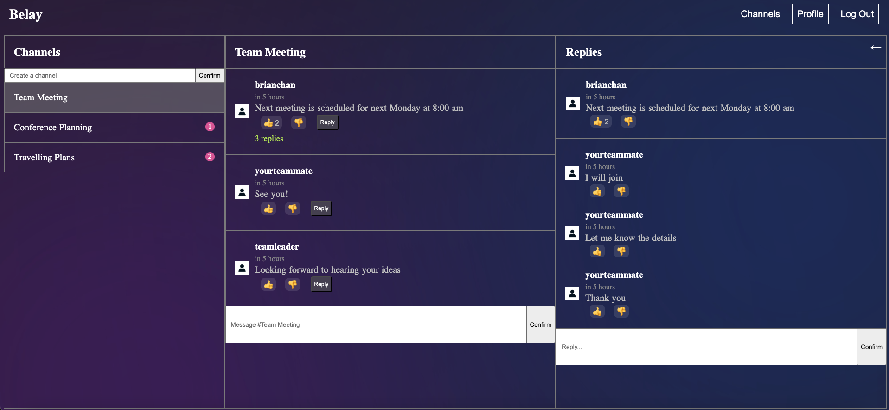

# Belay (a Slack clone)

Belay is a Slack clone that allows users to create chat rooms, send messages, and reply to messages. Users can also react to messages with emojis.




## Tech Stack

Front End: React.js

Back End: Node.js, Express.js

Database: SQLite3

Container: Docker

Programming Languages: TypeScript, JavaScript

## How to run Belay

With Docker (recommended):

```bash
docker compose up --build
```

Without Docker:

Open two terminal windows. 

In the first terminal, change directory to the `backend` directory
```bash
cd backend
```

Install the dependencies
```bash
npm install
```

Launch the backend server
```bash
npm run dev
```

In the second terminal, change directory to the `frontend` directory
```bash
cd frontend
```

Install the dependencies
```bash
npm install
```

Launch the front end server
```bash
npm run dev
```

Now you can open your browser and navigate to `http://localhost:5173` to see the app.

## How to build files

For backend, change directory to the `backend` directory
```bash
cd backend
```

Build the files
```bash
npx tsc
```

For frontend, change directory to the `frontend` directory
```bash
cd frontend
```

Build the files
```bash
npm run build
```

